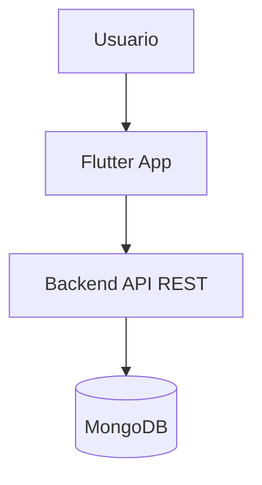
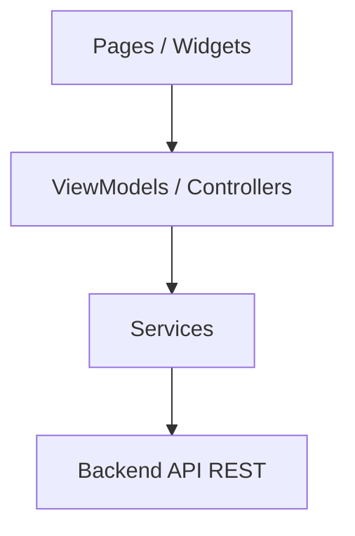
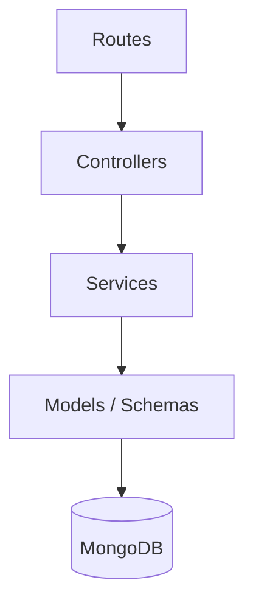
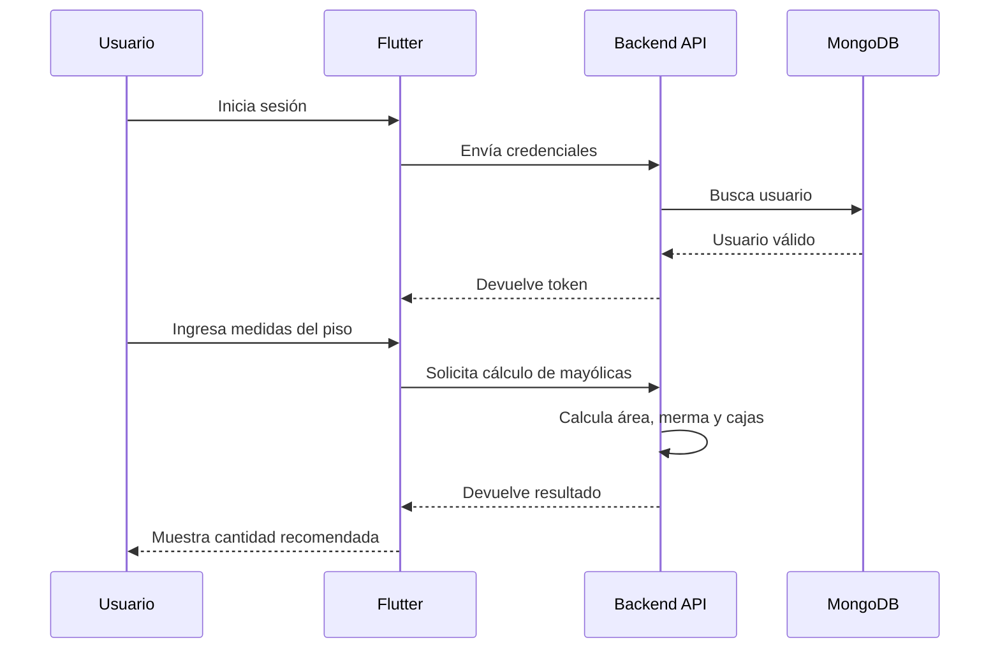

# Arquitectura del Proyecto Hogar360

## 1. Descripción general

Hogar360 es una aplicación móvil de utilidad doméstica enfocada, en su primera versión, en resolver dos problemas concretos:

- Calcular la cantidad de mayólicas o cajas necesarias para cubrir un piso.
- Permitir que el usuario revise una paleta de colores de pintura antes de comprar.

La aplicación también incluye login y registro para identificar al usuario y permitir que sus datos o cálculos puedan guardarse en el backend.

---

## 2. Arquitectura recomendada

La arquitectura recomendada es una **arquitectura cliente-servidor con organización modular por capas simples**.

Esta arquitectura es adecuada porque Hogar360 necesita:

- Una app móvil en Flutter.
- Un backend API REST.
- Una base de datos para usuarios, cálculos y colores.
- Separación clara entre interfaz, lógica y persistencia.
- Una estructura fácil de implementar, mantener y explicar.

No se recomienda Clean Architecture como arquitectura principal para la primera versión porque el alcance actual no tiene suficiente complejidad como para justificar tantas capas, interfaces y abstracciones.

---

## 3. Vista general



| Componente | Responsabilidad |
|---|---|
| Flutter App | Mostrar pantallas, formularios, navegación, resultados y paleta de colores. |
| Backend API REST | Gestionar autenticación, cálculos, usuarios y datos consultados por la app. |
| MongoDB | Guardar usuarios, cálculos realizados y catálogo de colores. |

---

## 4. Módulos principales del MVP

### 4.1 Autenticación

Permite que el usuario cree una cuenta e inicie sesión.

Funciones:

- Registro.
- Login.
- Cierre de sesión.
- Validación de token.
- Protección de rutas internas.

### 4.2 Menú principal

Pantalla inicial después del login.

Opciones:

- Calculadora de mayólicas.
- Paleta de colores de pintura.

### 4.3 Calculadora de mayólicas

Permite calcular materiales para pisos.

Entradas:

- Largo del piso.
- Ancho del piso.
- Largo de la mayólica.
- Ancho de la mayólica.
- Cantidad de mayólicas por caja.
- Porcentaje de merma.

Salidas:

- Área del piso.
- Área de la mayólica.
- Cantidad base de mayólicas.
- Cantidad final con merma.
- Número de cajas necesarias.

### 4.4 Paleta de colores de pintura

Permite revisar colores disponibles o referenciales.

Datos sugeridos:

- Nombre del color.
- Código hexadecimal.
- Categoría o familia de color.
- Vista previa visual.

---

## 5. Arquitectura interna de Flutter



Capas:

- **Presentación:** pantallas y widgets.
- **Estado y coordinación:** ViewModels o Controllers.
- **Datos remotos:** servicios HTTP y modelos JSON.

Estructura sugerida:

```txt
lib/
├── main.dart
├── app/
│   ├── app.dart
│   ├── routes.dart
│   └── theme.dart
├── core/
│   ├── constants/
│   ├── network/
│   └── utils/
└── modules/
    ├── auth/
    │   ├── pages/
    │   ├── models/
    │   ├── viewmodels/
    │   └── services/
    ├── home/
    │   ├── pages/
    │   └── widgets/
    ├── tiles_calculator/
    │   ├── pages/
    │   ├── models/
    │   ├── viewmodels/
    │   └── services/
    └── paint_palette/
        ├── pages/
        ├── models/
        ├── viewmodels/
        └── services/
```

---

## 6. Arquitectura interna del backend



Capas:

- **Routes:** definen endpoints.
- **Controllers:** reciben solicitudes y devuelven respuestas.
- **Services:** contienen lógica de negocio y cálculos.
- **Models/Schemas:** representan datos guardados en MongoDB.

Estructura sugerida:

```txt
src/
├── app.js
├── server.js
├── config/
│   └── database.js
├── middlewares/
│   └── auth.middleware.js
└── modules/
    ├── auth/
    │   ├── auth.routes.js
    │   ├── auth.controller.js
    │   ├── auth.service.js
    │   └── user.model.js
    ├── tiles/
    │   ├── tiles.routes.js
    │   ├── tiles.controller.js
    │   ├── tiles.service.js
    │   └── tile-calculation.model.js
    └── paint/
        ├── paint.routes.js
        ├── paint.controller.js
        ├── paint.service.js
        └── paint-color.model.js
```

---

## 7. Flujo principal



---

## 8. Crecimiento futuro

La arquitectura permite agregar módulos después sin rehacer toda la app:

- Cálculo de pintura por pared.
- Registro de habitaciones.
- Puertas y ventanas.
- Lista de compras.
- Exportación de resultados.
- Validación de muebles.

Estos módulos se pueden incorporar como nuevas carpetas dentro de `modules/`.

---

## 9. Conclusión

La arquitectura cliente-servidor con módulos por capas simples es correcta para Hogar360. Es suficientemente ordenada para separar responsabilidades, pero no introduce complejidad innecesaria para una app cuyo MVP se centra en autenticación, cálculo de mayólicas y paleta de colores.
