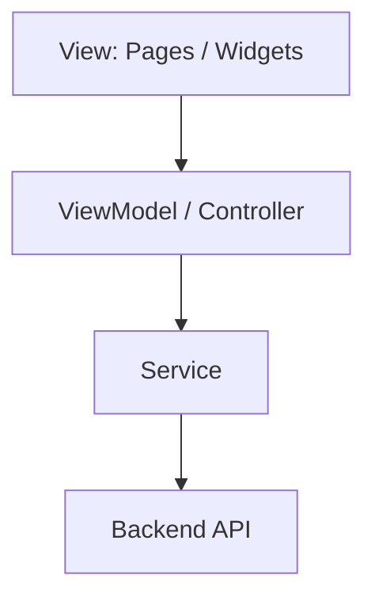
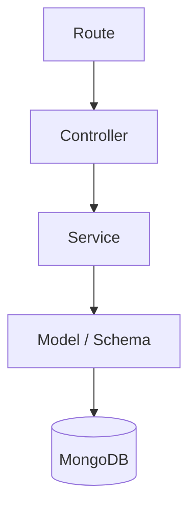

# Patrón de Diseño del Proyecto Hogar360

## 1. Decisión principal

Para Hogar360 se recomienda usar una combinación simple:

- **MVVM ligero en Flutter** para organizar pantallas, estado y servicios.
- **Service Pattern en backend** para separar controladores, lógica de negocio y acceso a datos.

Esta combinación es adecuada para una aplicación móvil con login, calculadora de mayólicas y paleta de colores. No es necesario aplicar Clean Architecture en la primera versión porque agregaría más complejidad de la que el proyecto necesita actualmente.

---

## 2. Por qué no usar Clean Architecture como base

Clean Architecture puede ser útil en aplicaciones grandes, con muchas reglas de negocio, varios equipos, pruebas complejas o cambios frecuentes de dominio.

En Hogar360, el MVP tiene un alcance más directo:

- Autenticación.
- Menú principal.
- Cálculo de mayólicas.
- Consulta de colores de pintura.

Por eso conviene priorizar una estructura clara, modular y fácil de implementar.

---

## 3. Patrón en frontend

El frontend debe usar **MVVM ligero**.

Responsabilidades:

| Parte | Responsabilidad |
|---|---|
| Model | Representa datos como usuario, cálculo de mayólicas o color de pintura. |
| View | Muestra pantallas, formularios, botones y resultados. |
| ViewModel | Maneja estado, validaciones básicas y llamadas a servicios. |
| Service | Se comunica con el backend por HTTP. |

Para más detalle, ver `patron_de_diseño_frontend.md`.

---

## 4. Patrón en backend

El backend debe usar **Service Pattern**.

Responsabilidades:

| Parte | Responsabilidad |
|---|---|
| Route | Define las URLs disponibles. |
| Controller | Recibe solicitudes HTTP y devuelve respuestas. |
| Service | Contiene autenticación, validaciones y fórmulas. |
| Model / Schema | Define cómo se guardan los datos. |

Para más detalle, ver `patron_de_diseño_backend.md`.

---

## 5. Patrones por módulo

| Módulo | Patrón recomendado | Motivo |
|---|---|---|
| Auth | MVVM ligero + Service Pattern | Login y registro necesitan estado en frontend y seguridad en backend. |
| Home | MVVM ligero | Solo coordina navegación hacia las funciones principales. |
| Calculadora de mayólicas | MVVM ligero + Service Pattern | La pantalla captura datos y el backend centraliza la fórmula. |
| Paleta de colores | MVVM ligero + Service Pattern | El frontend muestra colores y el backend puede administrar el catálogo. |

---

## 6. Conclusión

El patrón definido sí es adecuado para Hogar360 siempre que se mantenga enfocado en el alcance real del MVP. La recomendación es no mezclar demasiadas funciones futuras en la primera implementación y mantener cada módulo separado, pero sin crear capas innecesarias.
