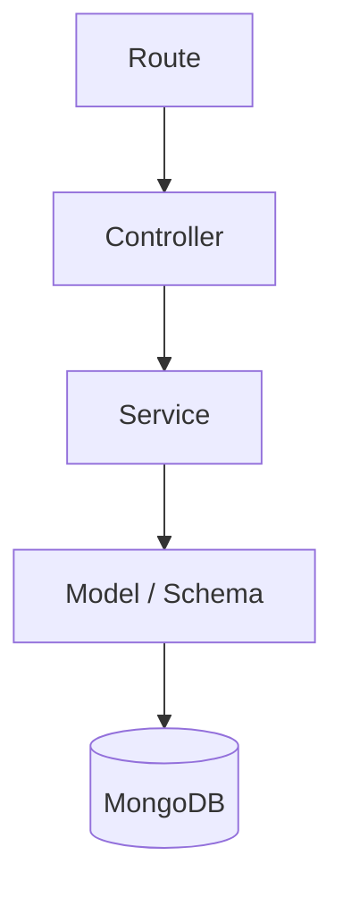

# Patrón de Diseño Backend

## 1. Patrón recomendado

El backend de Hogar360 debe usar **Service Pattern** con separación por módulos.

Este patrón permite que los controllers se encarguen de HTTP y que los services concentren la lógica de negocio, como autenticación y cálculo de mayólicas.

---

## 2. Estructura del patrón



---

## 3. Responsabilidades

### Routes

Definen las rutas disponibles.

Ejemplos:

- `/api/auth/login`
- `/api/auth/register`
- `/api/tiles/calculate`
- `/api/paint/colors`

### Controllers

Reciben la solicitud HTTP y devuelven una respuesta.

Responsabilidades:

- Leer `req.body`, `req.params` o `req.query`.
- Llamar al service correspondiente.
- Manejar respuestas exitosas.
- Manejar errores conocidos.

El controller no debe contener la fórmula de cálculo de mayólicas.

### Services

Contienen la lógica principal.

Responsabilidades:

- Registrar usuarios.
- Validar credenciales.
- Generar tokens.
- Calcular mayólicas.
- Consultar colores.
- Preparar datos antes de guardarlos.

### Models / Schemas

Representan los datos en MongoDB.

Ejemplos:

- `User`
- `TileCalculation`
- `PaintColor`

---

## 4. Repository Pattern

El Repository Pattern no es obligatorio para el MVP.

Se recomienda agregarlo solo si:

- Las consultas a MongoDB se repiten mucho.
- Los services empiezan a tener demasiada lógica de acceso a datos.
- Se necesita cambiar la base de datos en el futuro.

Para la primera versión, se puede trabajar con services y models directamente.

---

## 5. Organización sugerida

```txt
src/
├── app.ts
├── server.ts
├── config/
│   ├── database.ts
│   └── env.ts
├── middlewares/
│   ├── auth.middleware.ts
│   ├── error.middleware.ts
│   └── request-logger.middleware.ts
├── utils/
│   ├── async-handler.ts
│   └── http-error.ts
├── routes/
│   └── index.ts
└── modules/
    ├── auth/
    │   ├── auth.routes.ts
    │   ├── auth.controller.ts
    │   ├── auth.service.ts
    │   └── user.model.ts
    ├── tiles/
    │   ├── tiles.routes.ts
    │   ├── tiles.controller.ts
    │   ├── tiles.service.ts
    │   └── tile-calculation.model.ts
    └── paint/
        ├── paint.routes.ts
        ├── paint.controller.ts
        ├── paint.service.ts
        └── paint-color.model.ts
```

---

## 6. Ventajas para Hogar360

- Mantiene el backend ordenado.
- Evita poner lógica de negocio en los controllers.
- Facilita probar la fórmula de mayólicas.
- Permite agregar nuevos módulos sin desordenar el proyecto.
- Es fácil de explicar en una sustentación académica.

---

## 7. Conclusión

Service Pattern es suficiente para el backend de Hogar360. Permite separar responsabilidades sin sobreingeniería y se adapta bien al alcance actual de autenticación, cálculo de mayólicas y paleta de colores.
