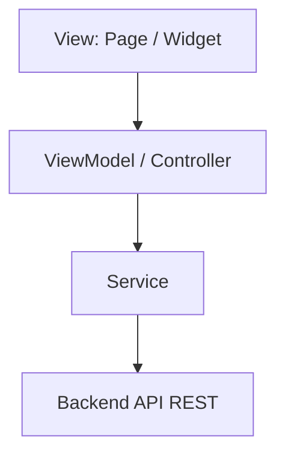

# Patrón de Diseño Frontend

## 1. Patrón recomendado

El frontend de Hogar360 debe usar **MVVM ligero**.

Este patrón permite separar la interfaz visual, el estado de cada pantalla y la comunicación con el backend sin crear una estructura demasiado compleja.

---

## 2. Estructura del patrón



---

## 3. Responsabilidades

### View

Representa la interfaz visual.

Ejemplos:

- `LoginPage`
- `RegisterPage`
- `HomePage`
- `TilesCalculatorPage`
- `PaintPalettePage`

Responsabilidades:

- Mostrar formularios.
- Mostrar botones y navegación.
- Mostrar resultados.
- Mostrar errores de validación.
- Enviar acciones al ViewModel.

La View no debe contener fórmulas extensas ni llamadas HTTP directas.

### ViewModel / Controller

Coordina el estado de la pantalla.

Responsabilidades:

- Validar campos básicos.
- Manejar estados de carga.
- Manejar mensajes de error.
- Llamar a servicios.
- Guardar temporalmente resultados.
- Notificar cambios a la View.

### Model

Representa los datos usados por la app.

Ejemplos:

- `User`
- `TileCalculationRequest`
- `TileCalculationResult`
- `PaintColor`

### Service

Se comunica con el backend.

Responsabilidades:

- Enviar solicitudes HTTP.
- Convertir JSON a modelos.
- Convertir modelos a JSON.
- Manejar errores de red.
- Centralizar rutas del backend.

---

## 4. Módulos frontend del MVP

### Auth

Pantallas:

- Login.
- Registro.

Estado:

- Cargando.
- Error.
- Usuario autenticado.

### Home

Pantalla principal después del login.

Opciones:

- Calculadora de mayólicas.
- Paleta de colores.

### Tiles Calculator

Pantalla para ingresar medidas y mostrar resultado.

Estado:

- Datos del formulario.
- Resultado del cálculo.
- Errores de validación.
- Cargando al calcular.

### Paint Palette

Pantalla para listar colores de pintura.

Estado:

- Lista de colores.
- Color seleccionado.
- Cargando.
- Error.

---

## 5. Estructura sugerida

```txt
lib/
├── app/
│   ├── app.dart
│   ├── routes.dart
│   └── theme.dart
├── core/
│   ├── network/
│   ├── constants/
│   └── utils/
└── modules/
    ├── auth/
    │   ├── pages/
    │   ├── widgets/
    │   ├── models/
    │   ├── viewmodels/
    │   └── services/
    ├── home/
    │   ├── pages/
    │   └── widgets/
    ├── tiles_calculator/
    │   ├── pages/
    │   ├── widgets/
    │   ├── models/
    │   ├── viewmodels/
    │   └── services/
    └── paint_palette/
        ├── pages/
        ├── widgets/
        ├── models/
        ├── viewmodels/
        └── services/
```

---

## 6. Ventajas para Hogar360

- Mantiene pantallas limpias.
- Facilita manejar formularios y resultados.
- Permite reutilizar servicios.
- Evita mezclar UI con lógica de negocio.
- Es adecuado para una app Flutter pequeña o mediana.

---

## 7. Conclusión

MVVM ligero es el patrón más adecuado para el frontend de Hogar360. Da orden suficiente para trabajar con login, menú principal, calculadora de mayólicas y paleta de colores, sin convertir el proyecto en una estructura innecesariamente pesada.
